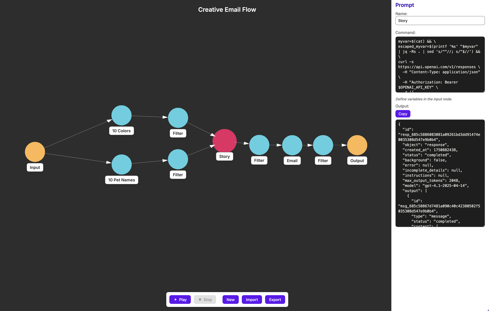

WIP: Documentation in process...

# Why?
Makes it easy and flexible to design, iterate, save, and share multi-step prompt flows.
- Why multi-step prompts? Let each prompt do one thing and it will do it better, rather than many tasks at the time.
- Sometime you want to reuse prompts that you know work well, and sometimes this prompts are complex (eg. ongoing conversations midway, or glued prompts from different models).
- Build the best prompts and share them with the community, then we can rank them and everyone can use the best prompt-flow for a given task and not have to reinvent the wheel.

# Setup
1. install rustup.
2. Run `npm install` to pull in dependencies including Vite, Svelte plugins, and Tauri packages.
3. Run `npm run check` to type-check and validate Svelte components (`svelte-check`).
4. During development:
   • `npm run dev` to start Vite’s dev server.
   • In another shell (or via `npm run tauri:dev`) launch the Tauri window pointing at localhost.
4. For production:
   • `npm run build` to produce a `dist/` folder.
   • `npm run tauri:build` to package your desktop app.

# Examples
Import the example flows in the examples folder.

# Notes
Set your OpenAI API key in your prompt flow one of two ways:
  • In the Input node's Variables panel, add a variable named `OPENAI_API_KEY` with your key.
  • In each OpenAI node's editor, enter the key in the new "API Key" field.

# Security
This app can run dangerous commands, always make sure you know what you're doing.
Use this app under your own responsibility.
Always verify commands you didn't write before running them.

# Build Icons
tauri icon icons/source/OpenPromptsIcon.png

# Build
tauri build --bundles dmg

needs noratization.

## Chat
[Discord Chat](https://discord.gg/Xek8mfCqSs)

## License

This project is licensed under the **GNU Affero General Public License v3.0**.  
See the [LICENSE](./LICENSE) file for details.

## AI Notice

This project was VibeCoded as a protoype and may need refactoring.
