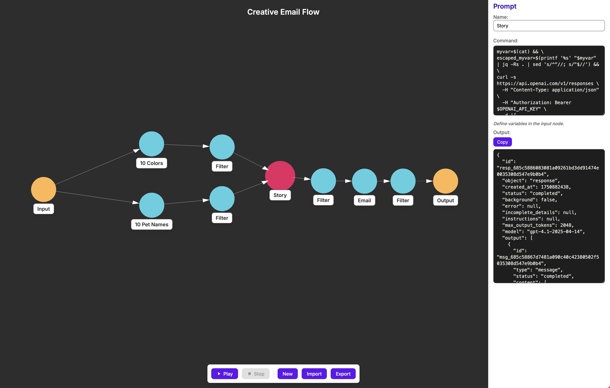

WIP: Documentation in process...

# Why?
Makes it easy and flexible to design, iterate, persist, and share multi-step prompt flows.

# Setup
install rustup.    
    1. Run `npm install` to pull in Vite, @sveltejs/vite-plugin-svelte and @tauri-apps packages.
    2. During development:
       • `npm run dev` to start Vite’s dev server.
       • In another shell (or via `npm run tauri:dev`) launch the Tauri window pointing at localhost.
    3. For production:
       • `npm run build` to produce a `dist/` folder.
       • `npm run tauri:build` to package your desktop app.

# Examples
Import the example flows in the examples folder.

# Notes
your env should have OPENAI_API_KEY for the examples.    

# Security
This app can run dangerous commands, always make sure you know what you're doing.
Use this app under your own responsibility.
Always verify commands you didn't write before running them.

